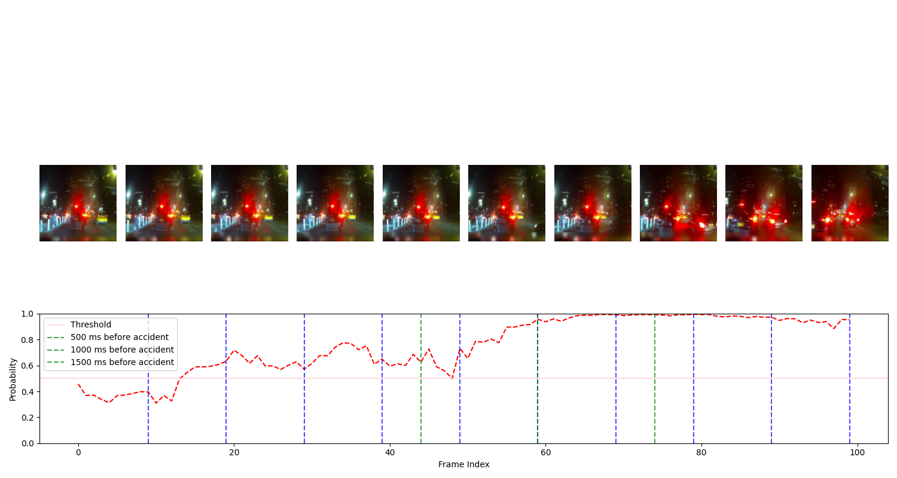
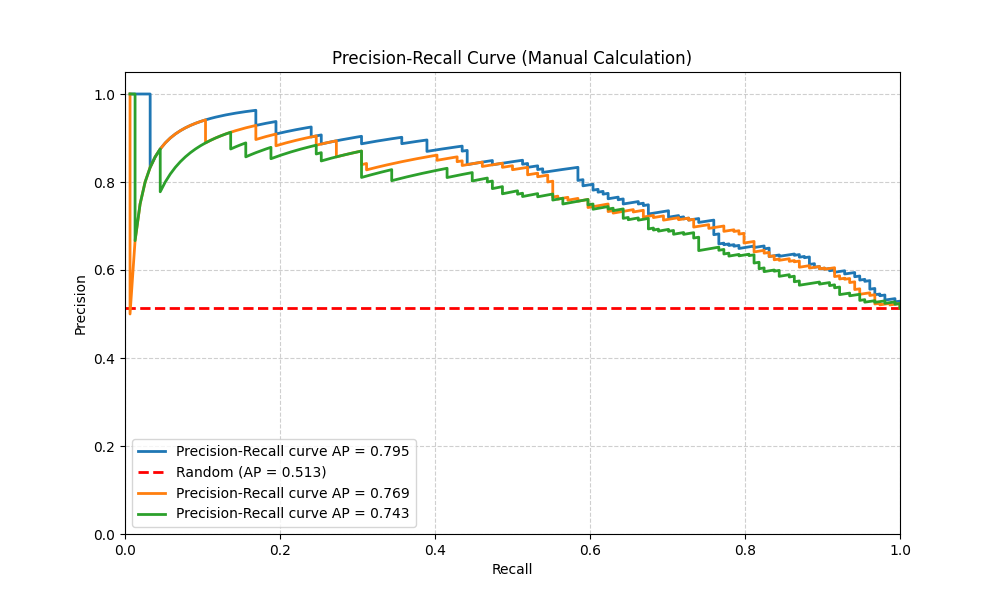
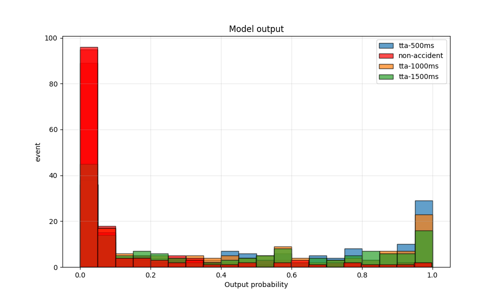

# DashCam
## Step 0. Environment setting:

```
conda config --set solver classic
conda create -n dashcam python=3.11
conda activate dashcam
pip3 install kaggle
pip3 install pandas
pip3 install decord 
pip3 install torch 
pip3 install torchvision
pip3 install opencv-python
pip3 install av  
pip3 install matplotlib 
pip3 install torchsummary
pip3 install pyyaml
pip3 install timesformer-pytorch
pip3 install scikit-learn
```

## Step 1. Dataset Download
```
kaggle competitions download -c nexar-collision-prediction;
unzip nexar-collision-prediction.zip -d dataset; # 29.2 G, it may take up to 20 minutes.
```
* This requires your authentication key and account ID, please follow [here](https://github.com/Kaggle/kaggle-api#download-dataset-files) for more details.

Once you unzip the zipped file, please rename the folder as "dataset". And You will see the dataset structured as:
```
./dataset
    - train # directory containing raw training videos with duration ~40 sec
    - test # directory containing raw test videos with duration ~10 sec
    train.csv # information of training videos. columns: (id, time_of_event, time_of_alert, target)
    test.csv # information of test videos. columns: (id)
    sample_submission.csv # sample format for submission.csv
```

## Step 2. Dataset Preprocessing
### Step 2.1 Dataset splitting and pre-processing 
Follow these steps to partition the training dataset into training and validation subsets. To maintain consistency across our team, please execute this script without any modifications.
```
sh ./scripts/dataset_preparation.sh
```
Once you execute the above command, you will see the new csv files:
```
./dataset
    - ...
    - img_database/
        frame-metadata_validation.csv
        frame-metadata_test.csv
        frame-metadata_train.csv
        train.csv
        test.csv
        - train #size: 1200
            video_XXXXX/
            ...
        - validation #size: 300
            video_XXXXX/
            ...
        - test/
            video_XXXXX/
            ...
    - ...   
```


## Step 3. Training (To-Be-Done)
Simple command-line example:
```
python3 -m scripts.train experiment/mvit2.yaml
```

## Step 4. Analysis Visualization 



### Step 4.1 Probability distribution across frame indices

```
python3 ./accident_prediction_vis.py --clip_path dataset/train/train_video/00043.mp4 --model_ckpt CHECKPOINT --filename probability --model_type [baseline:timesformer:swintransformer]
```

### Step 4.2 Likelihood & Recall vs Precision curve:
<table>
  <tr>
    <td></td>
    <td></td>
  </tr>
</table>


```
python3 ./score_assessment.py --model_ckpt ./sliding_window/model_ckpt-epoch01_bs10_lr0.0001.pt --num_workers 8 
```

## Step 5. Inference
```
python3 ./submission.py --num_workers 8 --model_ckpt <path_to_your_ckpt> --model_type baseline
kaggle competitions submit -c nexar-collision-prediction -f submission.csv -m "Message"
```
